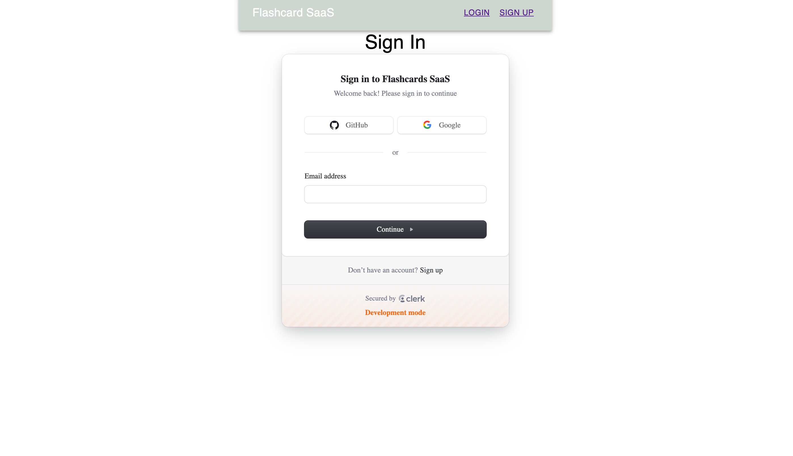
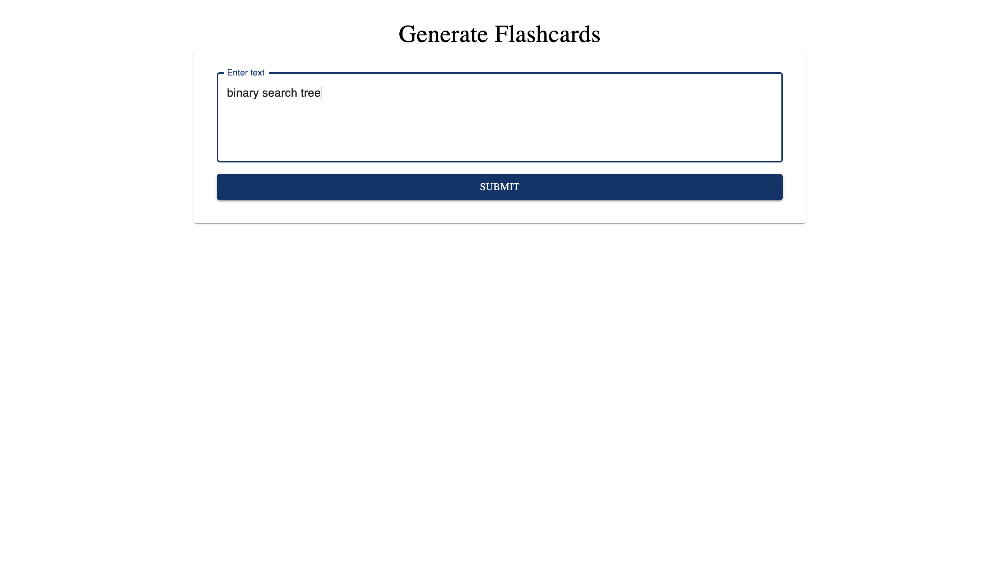
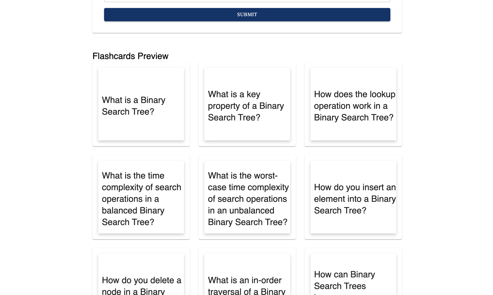
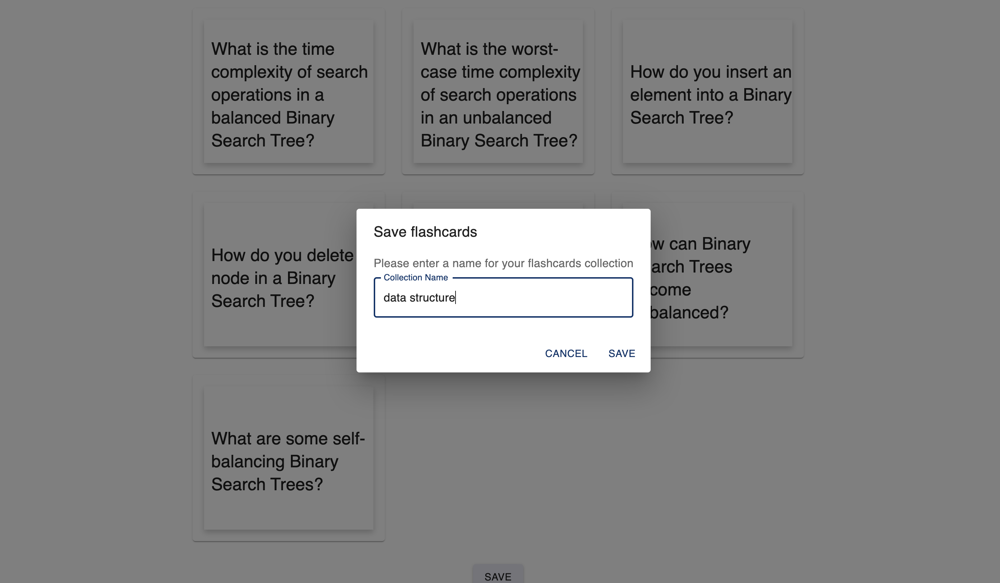

# FlashyCards 
# Project description
- This application automatically creates flashcards based on user input using AI, helping to streamline study sessions. It integrates Stripe API to handle payments and utilizes Clerk API for secure user authentication, offering a smooth and seamless user experience.
  
# App functionality
- Takes in topic description from user, then makes an API call to OpenAI model to generate the customized flashcards.
- The application involves subsciption plan that is made by with Stripe
- Authentication for Log in and Log out is made with Clerk API

# Stack:
- Front-end: React.js, Next.js, Material UI
- Back-end: Node.js
- Authentication: Clerk API
- Payment Service: Stripe API

# App demo:

