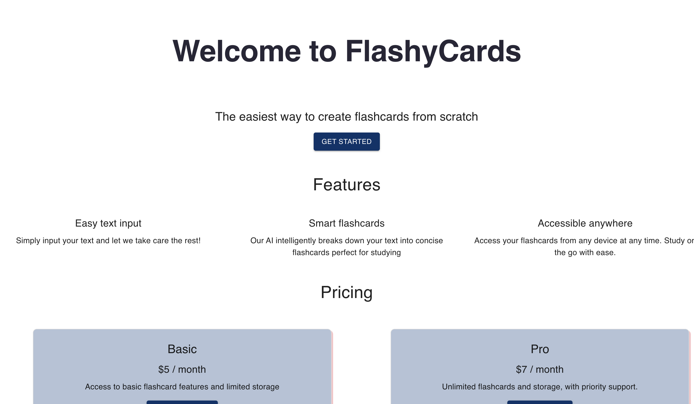

# Customer Support Chatbot with Llama3 model from AWS Bedrock 
# Project description
- This project involves developing a robust customer support chatbot powered by the Llama3 model, accessible via the AWS Bedrock API. The chatbot is designed to streamline customer interactions, providing real-time responses to user queries with natural, context-aware conversations. This project focuses on integrating AWS Bedrock’s infrastructure for scalability, ensuring the chatbot can handle high traffic and adapt to diverse user needs, ultimately enhancing customer experience and operational efficiency.

# App functionality
- Answer questions from users

# Stack:
- Front-end: React.js, Next.js, Material UI
- Back-end: Node.js
- LLMs model: Llama3 from AWS Bedrock API reference

# App demo:

